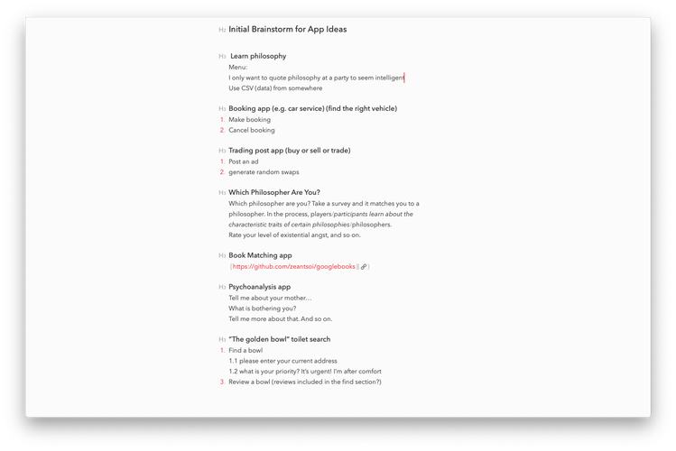

# Terminal App : Biblio Curious

A book search, preview, and save app written in Ruby.

## Contributor

https://github.com/mark-tomlinson-dev

## Purpose

The purpose of Biblio Curious is to promote chance and discovery in a world of increasing order and control. Humans have never had so much information at their fingertips and yet our technologies are often used to reinforce our current preferences rather than broaden our horizons. Biblio Curious aims to flip the script by inviting users to exercise and stimulate their natural, though perhaps dormant, curiosity about anything and everything.     

## Scope

The application is for both those who are curious and those who have forgotten how to be. It is suitable for any age level and any background.

Currently the user interface is available in English only, though it is entirely possible to search in any language and return results in those languages.

Search results in French:

## User Interaction and Experience

Users interact with Biblio Curious via a series of menus and menu options. Textual user prompts aim to provide clear and cheerful instructions. Particular attention has been paid to tone. Users are to feel encouraged and inspired to exercise their curiosity and, above all, to view the opportunity to search as an opportunity to let their imaginations run wild.

Error handling has been incorporated into the program at two levels. If the program receives unexpected user input (e.g. a number outside the range of menu options) it will print an error message and request another input. If a string of gibberish is encountered, a raise and rescue is initialised. 

From the opening menu, the user will be aware of three options: search, view bookshelf, and exit. Inside the search feature, the user will progressively discover additional features: read the book and view the cover. Such nesting of features has been designed specifically to be in keeping with the themes of curiosity, discovery and surprise.

The 'what would you like to do next menu' is deliberately run on a loop to give the impression of limitless enquiry to the user.

Finally, upon exit, the user is thanked for taking the time to experience this curious little application. 

## Features

Based on user input, Biblio Curious has a search feature that returns a list of five book titles from the Google Books database. The default search returns results by relevance. It filters out books that do not include a book preview option.

After users select a title from the list, the program displays the author, publication date and description of the book.

Users can then decide to read the book (often the full content, but most often a preview), view the cover, save the book to their virtual bookshelf, conduct a new search, or return to the main menu.

Users can search, read, and save as many times as they like.

From the main menu, they can access their virtual bookshelf and see all the items they have saved in that session. 

With their curiosity satisfied, users are able to exit the program from the main menu. 

## Instructions for Use

1. Open Terminal or your preferred console.

2. Make sure you have Ruby installed on your machine.

2. Clone the terminal-app repository.

3. cd into the appropriate directory.

4. To install the program, enter:

`$ bash build.sh`

This will install the following Ruby gems:

- tty-font
- googlebooks
- colorize

5. To initialise the program, enter:

`$ ruby main.rb`

6. Let loose your curiosity!

## Implementation Plan

In order to bring the features of Biblio Curious to life, a number of important steps had to be taken.

### Implementing the Search Feature

The core of the application is its search feature. To fulfill the brief, it had to be able to return meaningful and diverse results from almost any search term. To solve this problem the GoogleBooks Ruby gem was used. The GoogleBooks gem queries the Google API to search for publications in the Google Books repository. With over 130 million titles, the repository provides the ideal range of data for users to get curious and stay curious for as long as they like. 

Tasks completed:

- [x] Install GoogleBooks gem from the terminal 
- [x] Discover its capabilities and how to use them
- [x] 'Require' its use in the run file (main.rb)
- [x] Follow basic usage guide in the gem's documentation
- [x] Set search parameters 

### Implementing the Book Preview Feature

The GoogleBooks gem was also used to implement other important features within the search feature. Biblio Curious returns a limited number of search results. It also provides users with a link to an image of the cover and to a link to the full text or partial text (depending on availability). The gem is the perfect tool as it allows developers to specify how many results the search should yield. It also allows developers to filter results by whether or not a preview of the book is available. Biblio Curious takes advantage of that to ensure there will always be access to a text preview and cover image (the former necessitating the latter).

`books = GoogleBooks.search(search_term, {:count => 5, :page => 1, :filter => 'partial'})`

Here the variable 'books' is asked to store five results from the first page of results, filtering out results that do not contain at least a partial preview. 

Tasks completed:

- [x] Consult the gem's documentation to ascertain correct methods and syntax
- [x] Write and test code
- [x] Introduce code into the control flow
- [x] Refactor code as required
- [x] Provide user instructions for accessing url links from terminal or console

### Implementing the Bookshelf Feature

Another important feature of Biblio Curious is its bookshelf feature. Users can store any book they like in an accessible, ordered list. They can move back and forth between the bookshelf and the search function. At the end of a single session, truly curious users have a truly curious list they can consult.

In order to implement such a feature, Biblio Curious declares an empty array `bookshelf = []` in global scope and passes it in as an argument to the requisite methods. At the appropriate time, the title of the chosen book `chosen_book.title` is  pushed into the bookshelf array: `bookshelf << chosen_book.title`.

Tasks completed:

- [x] Create empty array and declare it in global scope
- [x] When user has chosen a pariticular book, provide them with the option of saving it to their bookshelf
- [x] Push chosen book into bookshelf array
- [x] Design and implement bookshelf menu options
- [x] Test and debug usability 

## Control Flow / User Journey

## Designing and Planning

### Brainstorming

The design process was kicked off by a brainstorming session inside Bear:

Later, note-taking switched to pen and paper as I explored the functionality of the GoogleBooks gem:

### Task Management

A Trello board was utilised to manage the project. Tasks were prioritised (most important first), outlined, and broken down into component parts. All items began in 'backlog', moved to 'doing', then, finally, to 'done'. This helped keep the project focused and on track.

Tasks with multiple stages were individually logged and checked off:

Getting there!

## Challenges

- Learning to use GoogleBooks gem.

- Refactoring code in an attempt to achieve DRY.

- Error handling. Biblio Curious is heavily reliant on user input and therefore at the mercy of user behaviour.

## Future Enhancements

- Allow users to create profile.

- Store bookshelf items across multiple sessions using CSV.

- Refactor code so that terminal can be cleared at appropriate moments.

- Improving design by implementing TTY-Prompt gem.

- Improve error handling.

- Randomise the search so that a single search term entered on two different occassions will return two different lists.

